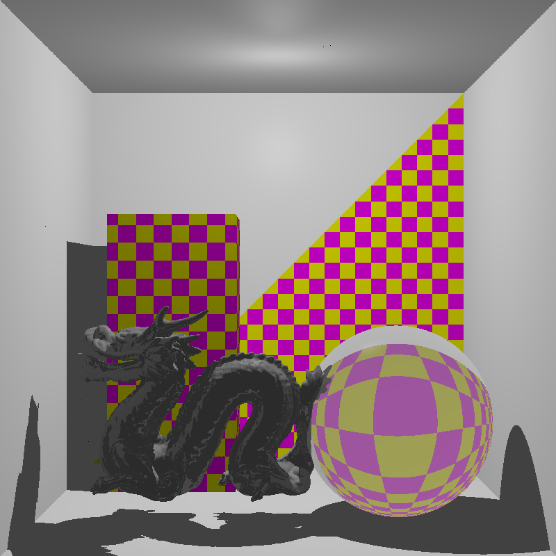

#Scalarty

This piece of software is my attempt to learn Scala by implementing a raytracer with various features.
Since my first raytracer was named *Arty*, a phonetic version of the abbreviation of raytracer (RT), I named it 
 *Scalarty*. Doesn't sound cool, but naming is hard anyway.
 
 Current features include:
  - point light sources
  - supersampling (combinable with edge detection)
  - diffuse, reflected and refractied rays
  - BVH with an SAH implementation
  - single color and checker board textures
##Usage
 Compile the sources via 
 ```
 $ sbt compile
 ```
 To run all test and generate a coverage report run:
 ```
 $ sbt clean coverage test
 ``` 
 and 
 ```
 $ sbt coverageReport
 ```
 
 Scenes are given as JSON files, to compile an example scene:
 ```
 $ sbt "run -i scenes/cornell.json -o image.png"

```
 
##Example Renderings
 
